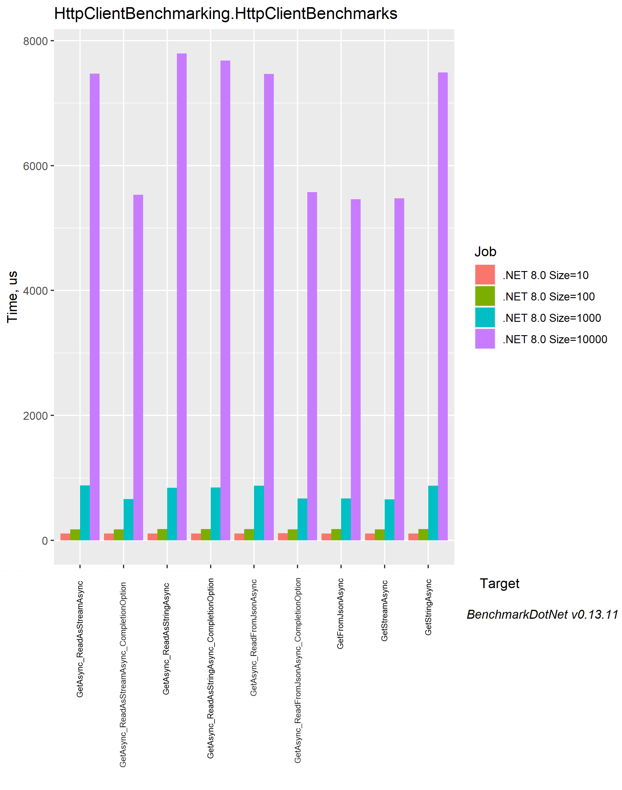

# HttpClientBenchmarking
Benchmarking ways C#'s `HttpClient` being used so we can all better understand performance and use cases.

## How to run
1. Get the repo
1. Run `RunBenchmark.ps1`
	- This runs both the API project and begins the benchmarking project

## Test Scenario

1. Firing off requests for JSON data from a given API 
1. The data is then deserialized

There are nine ways of using `HttpClient` to get JSON data and they are compared for n = 10, 100, 1000, 10000 JSON object sizes.

The JSON data is from the default .NET minimal API example, and looks like:

```json
[
	{
		"date": "2023-12-13",
		"temperatureC": 48,
		"summary": "Hot",
		"temperatureF": 118
	}
]
```

### Other Points

- Benchmarks generated via [BenchmarkDotNet](https://benchmarkdotnet.org/)
- Benchmark class is [HttpClientBenchmarks.cs](src/HttpClientBenchmarking/HttpClientBenchmarks.cs)
- The API project is [HttpClientBenchmarking.Api](src/HttpClientBenchmarking.Api)

## Results

*The generated graph order does not match the order of the results table* 😢



| Method                                      | Size  | Mean       | Error     | StdDev    | Median     | Ratio | RatioSD | Gen0      | Gen1      | Gen2     | Allocated  | Alloc Ratio |
|-------------------------------------------- |------ |-----------:|----------:|----------:|-----------:|------:|--------:|----------:|----------:|---------:|-----------:|------------:|
| GetAsync_ReadAsStringAsync                  | 10    |   113.1 μs |   1.95 μs |   1.73 μs |   112.2 μs |  1.00 |    0.00 |    1.2207 |         - |        - |    5.67 KB |        1.00 |
| GetAsync_ReadAsStreamAsync                  | 10    |   110.4 μs |   1.42 μs |   1.19 μs |   110.6 μs |  0.98 |    0.02 |    0.9766 |         - |        - |    3.97 KB |        0.70 |
| GetAsync_ReadFromJsonAsync                  | 10    |   112.8 μs |   1.69 μs |   1.58 μs |   112.1 μs |  1.00 |    0.02 |    0.9766 |         - |        - |    4.27 KB |        0.75 |
| GetAsync_ReadAsStringAsync_CompletionOption | 10    |   112.0 μs |   0.91 μs |   0.81 μs |   111.8 μs |  0.99 |    0.02 |    1.2207 |         - |        - |    5.67 KB |        1.00 |
| GetAsync_ReadAsStreamAsync_CompletionOption | 10    |   112.2 μs |   0.99 μs |   0.82 μs |   112.4 μs |  0.99 |    0.02 |    0.7324 |         - |        - |    3.05 KB |        0.54 |
| GetAsync_ReadFromJsonAsync_CompletionOption | 10    |   115.1 μs |   2.10 μs |   4.91 μs |   112.8 μs |  1.01 |    0.03 |    0.7324 |         - |        - |    3.35 KB |        0.59 |
| GetStreamAsync                              | 10    |   113.0 μs |   0.72 μs |   0.57 μs |   112.9 μs |  1.00 |    0.02 |    0.7324 |         - |        - |    2.97 KB |        0.52 |
| GetStringAsync                              | 10    |   111.9 μs |   1.88 μs |   1.57 μs |   111.4 μs |  0.99 |    0.02 |    0.9766 |         - |        - |     4.8 KB |        0.85 |
| GetFromJsonAsync                            | 10    |   111.9 μs |   0.66 μs |   0.62 μs |   111.9 μs |  0.99 |    0.02 |    0.7324 |         - |        - |    3.72 KB |        0.66 |
|                                             |       |            |           |           |            |       |         |           |           |          |            |             |
| GetAsync_ReadAsStringAsync                  | 100   |   181.7 μs |   1.10 μs |   0.98 μs |   181.7 μs |  1.00 |    0.00 |    8.3008 |    0.4883 |        - |   35.39 KB |        1.00 |
| GetAsync_ReadAsStreamAsync                  | 100   |   178.9 μs |   2.15 μs |   1.91 μs |   178.5 μs |  0.98 |    0.01 |    4.8828 |         - |        - |   20.13 KB |        0.57 |
| GetAsync_ReadFromJsonAsync                  | 100   |   183.6 μs |   3.58 μs |   5.58 μs |   180.8 μs |  1.01 |    0.03 |    4.8828 |         - |        - |   20.42 KB |        0.58 |
| GetAsync_ReadAsStringAsync_CompletionOption | 100   |   181.4 μs |   0.97 μs |   0.76 μs |   181.5 μs |  1.00 |    0.01 |    8.3008 |         - |        - |   35.39 KB |        1.00 |
| GetAsync_ReadAsStreamAsync_CompletionOption | 100   |   175.9 μs |   0.98 μs |   0.87 μs |   175.9 μs |  0.97 |    0.01 |    1.9531 |         - |        - |    8.39 KB |        0.24 |
| GetAsync_ReadFromJsonAsync_CompletionOption | 100   |   177.1 μs |   1.16 μs |   0.97 μs |   176.7 μs |  0.97 |    0.01 |    1.9531 |         - |        - |    8.69 KB |        0.25 |
| GetStreamAsync                              | 100   |   176.7 μs |   2.67 μs |   2.37 μs |   176.0 μs |  0.97 |    0.01 |    1.9531 |         - |        - |     8.3 KB |        0.23 |
| GetStringAsync                              | 100   |   180.2 μs |   1.45 μs |   1.36 μs |   179.9 μs |  0.99 |    0.01 |    5.8594 |         - |        - |    23.7 KB |        0.67 |
| GetFromJsonAsync                            | 100   |   182.4 μs |   3.22 μs |   5.37 μs |   179.3 μs |  1.02 |    0.03 |    1.9531 |         - |        - |     9.2 KB |        0.26 |
|                                             |       |            |           |           |            |       |         |           |           |          |            |             |
| GetAsync_ReadAsStringAsync                  | 1000  |   841.4 μs |  12.98 μs |  10.13 μs |   842.6 μs |  1.00 |    0.00 |  126.9531 |   83.9844 |  82.0313 |  457.04 KB |        1.00 |
| GetAsync_ReadAsStreamAsync                  | 1000  |   881.0 μs |   6.81 μs |   5.68 μs |   880.1 μs |  1.05 |    0.02 |   78.1250 |   39.0625 |  39.0625 |  305.84 KB |        0.67 |
| GetAsync_ReadFromJsonAsync                  | 1000  |   877.0 μs |   6.78 μs |   6.34 μs |   876.2 μs |  1.04 |    0.01 |   78.1250 |   39.0625 |  39.0625 |  306.14 KB |        0.67 |
| GetAsync_ReadAsStringAsync_CompletionOption | 1000  |   846.3 μs |   9.44 μs |   7.88 μs |   845.6 μs |  1.01 |    0.01 |  126.9531 |   82.0313 |  82.0313 |  457.06 KB |        1.00 |
| GetAsync_ReadAsStreamAsync_CompletionOption | 1000  |   660.4 μs |   8.66 μs |   7.67 μs |   659.6 μs |  0.79 |    0.01 |   13.6719 |         - |        - |   58.01 KB |        0.13 |
| GetAsync_ReadFromJsonAsync_CompletionOption | 1000  |   669.4 μs |  13.17 μs |  16.17 μs |   667.4 μs |  0.80 |    0.02 |   13.6719 |    0.9766 |        - |   58.23 KB |        0.13 |
| GetStreamAsync                              | 1000  |   655.7 μs |   7.85 μs |   6.56 μs |   655.4 μs |  0.78 |    0.01 |   13.6719 |    0.9766 |        - |   57.91 KB |        0.13 |
| GetStringAsync                              | 1000  |   876.9 μs |  22.57 μs |  65.13 μs |   845.9 μs |  1.11 |    0.12 |   56.6406 |   42.9688 |  42.9688 |  209.19 KB |        0.46 |
| GetFromJsonAsync                            | 1000  |   672.1 μs |  12.43 μs |  10.38 μs |   672.3 μs |  0.80 |    0.02 |   13.6719 |    1.9531 |        - |   58.68 KB |        0.13 |
|                                             |       |            |           |           |            |       |         |           |           |          |            |             |
| GetAsync_ReadAsStringAsync                  | 10000 | 7,793.5 μs | 155.56 μs | 268.34 μs | 7,660.0 μs |  1.00 |    0.00 | 1093.7500 | 1093.7500 | 984.3750 | 4922.88 KB |        1.00 |
| GetAsync_ReadAsStreamAsync                  | 10000 | 7,469.3 μs | 114.95 μs | 107.53 μs | 7,488.8 μs |  0.96 |    0.04 |  593.7500 |  593.7500 | 500.0000 | 2662.29 KB |        0.54 |
| GetAsync_ReadFromJsonAsync                  | 10000 | 7,467.0 μs |  95.15 μs |  79.45 μs | 7,464.7 μs |  0.96 |    0.04 |  609.3750 |  609.3750 | 500.0000 | 2662.96 KB |        0.54 |
| GetAsync_ReadAsStringAsync_CompletionOption | 10000 | 7,678.6 μs | 107.05 μs | 100.13 μs | 7,683.3 μs |  0.98 |    0.04 | 1109.3750 | 1046.8750 | 984.3750 | 4922.51 KB |        1.00 |
| GetAsync_ReadAsStreamAsync_CompletionOption | 10000 | 5,530.7 μs |  95.23 μs |  93.52 μs | 5,509.9 μs |  0.71 |    0.03 |  101.5625 |   62.5000 |  39.0625 |   649.4 KB |        0.13 |
| GetAsync_ReadFromJsonAsync_CompletionOption | 10000 | 5,575.3 μs | 104.66 μs |  97.90 μs | 5,568.0 μs |  0.71 |    0.03 |  101.5625 |   62.5000 |  39.0625 |   649.7 KB |        0.13 |
| GetStreamAsync                              | 10000 | 5,476.0 μs |  50.20 μs |  39.20 μs | 5,473.6 μs |  0.70 |    0.03 |  101.5625 |   62.5000 |  39.0625 |  649.33 KB |        0.13 |
| GetStringAsync                              | 10000 | 7,488.2 μs | 120.12 μs | 138.33 μs | 7,458.6 μs |  0.96 |    0.04 |  250.0000 |  242.1875 | 164.0625 | 2915.64 KB |        0.59 |
| GetFromJsonAsync                            | 10000 | 5,462.2 μs |  56.19 μs |  46.92 μs | 5,465.0 μs |  0.70 |    0.03 |  101.5625 |   62.5000 |  39.0625 |  650.25 KB |        0.13 |

```
Size        : Value of the 'Size' parameter
Mean        : Arithmetic mean of all measurements
Error       : Half of 99.9% confidence interval
StdDev      : Standard deviation of all measurements
Median      : Value separating the higher half of all measurements (50th percentile)
Ratio       : Mean of the ratio distribution ([Current]/[Baseline])
RatioSD     : Standard deviation of the ratio distribution ([Current]/[Baseline])
Gen0        : GC Generation 0 collects per 1000 operations
Gen1        : GC Generation 1 collects per 1000 operations
Gen2        : GC Generation 2 collects per 1000 operations
Allocated   : Allocated memory per single operation (managed only, inclusive, 1KB = 1024B)
Alloc Ratio : Allocated memory ratio distribution ([Current]/[Baseline])
1 μs        : 1 Microsecond (0.000001 sec)
```

This data is found in the [dotnet8](results/dotnet8) folder.

### Other Results

Results for a comparison between .NET 6, .NET 7, and .NET 8 can be found in the [dotnet6-7-8](results/dotnet6-7-8) folder. 

In short, the focus on performance for .NET 8 really shows.

## Short Analysis

*The benchmark test cases can be found in [HttpClientBenchmarks.cs](src/HttpClientBenchmarking/HttpClientBenchmarks.cs)*

The test functions `GetStreamAsync()` and `GetFromJsonAsync()` are the simpliest and easiest to use with being among the top in performance for both execution time and memory allocation when compared to the default `GetAsync_ReadAsStringAsync()` test case. 

The test cases:
```csharp
// top performer
public async Task GetStreamAsync()
{
    using var stream = await _httpClient.GetStreamAsync(_url);

    var data = await JsonSerializer.DeserializeAsync<List<WeatherForecast>>(stream);
}
```

```csharp
// top performer
public async Task GetFromJsonAsync()
{
    var data = await _httpClient.GetFromJsonAsync<List<WeatherForecast>>(_url);
}
```

```csharp
// baseline
public async Task GetAsync_ReadAsStringAsync()
{
    using HttpResponseMessage response = await _httpClient.GetAsync(_url);

    var jsonResponse = await response.Content.ReadAsStringAsync();

    // Note this is NOT async when dealing with string input
    var data = JsonSerializer.Deserialize<List<WeatherForecast>>(jsonResponse);
}
```

Why are these good? They pass the `Stream` straight back to the user without buffering it - I.E. the data does not get copied into another `MemoryStream` *then* returned to the user. We can see the stream is passed back in the source [HttpClient.cs#L346](https://github.com/dotnet/runtime/blob/f83838b2ba88f8db115588ec2eab82b2993ccab4/src/libraries/System.Net.Http/src/System/Net/Http/HttpClient.cs#L346) file. The extension method `GetFromJsonAsync()` works the same way as seen in [HttpContentJsonExtensions.cs#L136](https://github.com/dotnet/runtime/blob/f83838b2ba88f8db115588ec2eab82b2993ccab4/src/libraries/System.Net.Http.Json/src/System/Net/Http/Json/HttpContentJsonExtensions.cs#L136).

This explains why `GetAsync_ReadAsStreamAsync_CompletionOption()` and `GetAsync_ReadFromJsonAsync_CompletionOption()` test methods are equally as good. Due to the `HttpCompletionOption.ResponseHeadersRead` option, we can also avoid the extra copy. We can see that in action ourselves in the source [HttpClient.cs#L479](https://github.com/dotnet/runtime/blob/f83838b2ba88f8db115588ec2eab82b2993ccab4/src/libraries/System.Net.Http/src/System/Net/Http/HttpClient.cs#L479) file.

### What about `HttpRequestMessage`?

You might've seen `HttpRequestMessage` when seeing `HttpClient` snippets. This object is used for more fine grained control over the request such as changing the verb. All the `SendAsync()` type calls end up using `HttpRequestMessage` in the end, even if all you pass is a URL to `SendAsync()`. Check it out yourself in the source [HttpClient.cs#L324](https://github.com/dotnet/runtime/blob/f83838b2ba88f8db115588ec2eab82b2993ccab4/src/libraries/System.Net.Http/src/System/Net/Http/HttpClient.cs#L324) file.

As a refresher, here's changing the verb to HEAD:

```csharp
using HttpRequestMessage request = new(HttpMethod.Head,"https://www.example.com");

using HttpResponseMessage response = await httpClient.SendAsync(request);
```

We're not concerned about it in respect to tangible performance.

## Why do this repo?
Over time .NET has evolved for the better, however these improvements may not make it to old StackOverflow answers or to Copilot easily. This repo is designed to compare all the relevant ways to use HttpClient that I see to help others and myself make informed decisions - and perhaps dispel some old myths. (For instance, it was confusing back when .NET Framework had [three native ways](https://stackoverflow.com/a/4015346) to make requests).

## References
This repo references or is inspired by the following people and their work:

| Person                                                                                                            | Reason                                                                                                                                              | Link                                                                                                                                                                                                         |
| ----------------------------------------------------------------------------------------------------------------- | --------------------------------------------------------------------------------------------------------------------------------------------------- | ------------------------------------------------------------------------------------------------------------------------------------------------------------------------------------------------------------ |
| [Steve Gordon](https://www.stevejgordon.co.uk/)                                                                   | Original inspiration for this repo - including the [benchmarking code](https://github.com/stevejgordon/HttpCompletionOptionBenchmarks).             | [Using HttpCompletionOption to Improve HttpClient Performance in .NET](https://www.stevejgordon.co.uk/using-httpcompletionoption-responseheadersread-to-improve-httpclient-performance-dotnet)               |
| [Abdul Rahman](https://www.linkedin.com/in/fingers10), [Regina Sharon](https://www.linkedin.com/in/regina-sharon) | Good, simple examples of different ways to use HttpClient with easy to understand diagrams.                                                         | [Improving performance and memory use while accessing APIs using HTTPClient in dotnet](https://ilovedotnet.org/blogs/improving-performance-and-memory-use-while-accessing-apis-using-http-client-in-dotnet/) |
| [John Thiriet](https://johnthiriet.com/)                                                                          | A post I read a long while ago about ways to speed up HttpClient - including some [benchmarks](https://github.com/johnthiriet/EfficientHttpClient). | [Efficient api calls with HttpClient and JSON.NET](https://johnthiriet.com/efficient-api-calls/)                                                                                                             |
| [Stephen Toub](https://devblogs.microsoft.com/dotnet/author/toub/)                                                | Writer of the inspirational .NET performance improvement tomes.                                                                                      | [Performance Improvements in .NET 8](https://devblogs.microsoft.com/dotnet/performance-improvements-in-net-8/)                                                                                               |

## Notes
- For the sake of simplicity there is no response checking or validating.
- You may find different performance depending on your hardware, OS, data, network speed, data type, etc. 
- Deserializing JSON was chosen as it's widely understood and a common workflow with `HttpClient`. So much so, we get the `GetFromJsonAsync()` extension method.

## Other Links
- [HttpClient Class via Microsoft](https://learn.microsoft.com/en-us/dotnet/api/system.net.http.httpclient?view=net-8.0)
- [Make HTTP requests with the HttpClient class via Microsoft](https://learn.microsoft.com/en-us/dotnet/fundamentals/networking/http/httpclient)
- [Guidelines for using HttpClient via Microsoft](https://learn.microsoft.com/en-us/dotnet/fundamentals/networking/http/httpclient-guidelines)
- [HttpClient JSON Extensions via Microsoft](https://learn.microsoft.com/en-us/dotnet/api/system.net.http.json.httpclientjsonextensions?view=net-8.0)
- [Starting PowerShell script in another window](https://stackoverflow.com/questions/23237473/powershell-launch-script-in-new-instance)
- [HttpRequestMessage Class via Microsoft](https://learn.microsoft.com/en-us/dotnet/api/system.net.http.httprequestmessage?view=net-8.0)